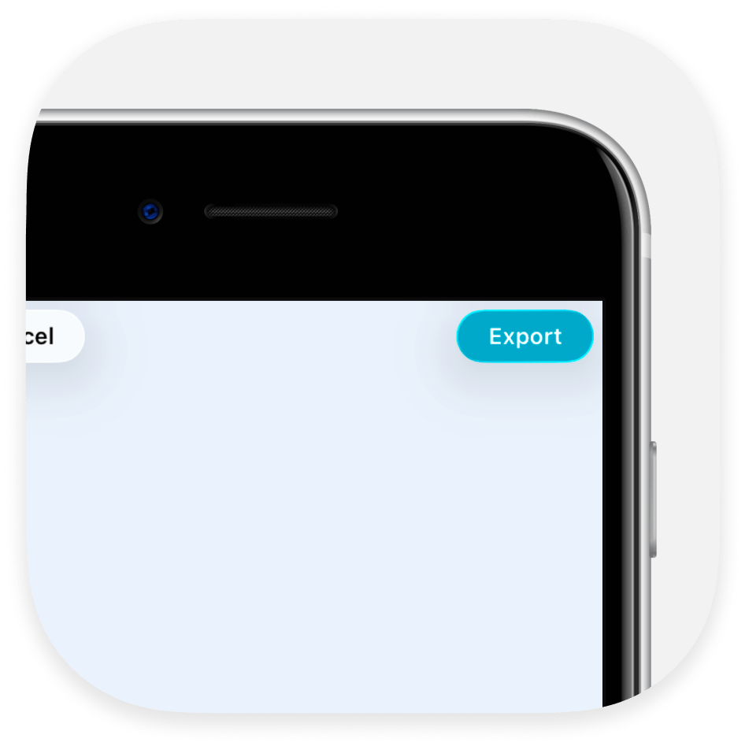
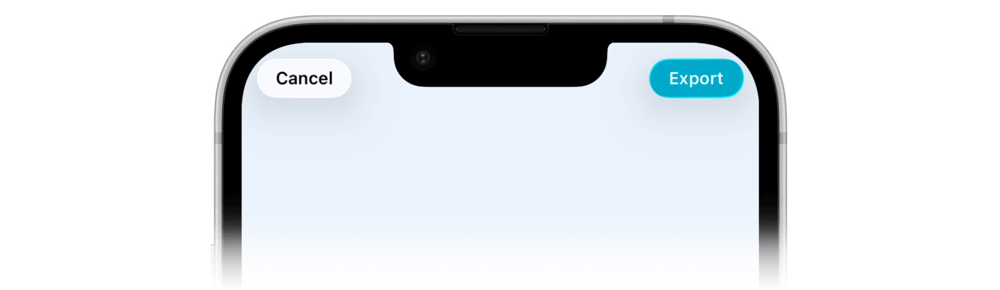

<div align="center">
  
  <h1><b>NotchMyProblem</b></h1>
  <p>
    Swift package that handles positioning UI elements around the iPhone's notch or Dynamic Island.
  </p>
</div>

<p align="center">
  <a href="https://swift.org"></a>
  <a href="https://developer.apple.com"></a>
  <a href="LICENSE"></a>
</p>

<div align="center">

|  |  |  |
|:--:|:--:|:--:|
| **Notch Devices** | **Dynamic Island** | **Standard Devices** |
| iPhone X → 14/Plus, 16e | iPhone 14 Pro+, 15/16/17 series, Air | Home button iPhones, iPads, Mac |

</div>


## Overview

NotchMyProblem automatically detects the device's top cutout and provides tools to create adaptive layouts without manual positioning.

- Automatically positions buttons around the notch or Dynamic Island
- Adapts to device-specific dimensions with built-in overrides
- Supports all modern iPhones: notch (iPhone X → 14/Plus, 16e), Dynamic Island (14 Pro+, 15/16/17 series, Air), and standard devices
- Intelligent padding system that scales with cutout size


## Installation

```swift
dependencies: [
    .package(url: "https://github.com/Aeastr/NotchMyProblem.git", from: "2.0.0")
]
```

```swift
import NotchMyProblem
```

Or in Xcode: **File > Add Packages…** and enter `https://github.com/Aeastr/NotchMyProblem`


## Usage

### CutoutAccessoryView

The simplest way to position UI elements around the notch/island:

```swift
struct MyView: View {
    var body: some View {
        ZStack {
            // Your main content here

            CutoutAccessoryView(
                padding: .auto,
                leadingContent: {
                    Button(action: { print("Left tapped") }) {
                        Image(systemName: "gear")
                    }
                },
                trailingContent: {
                    Button(action: { print("Right tapped") }) {
                        Text("Save")
                    }
                }
            )
        }
    }
}
```

### Manual Access

Access cutout dimensions directly when needed:

```swift
let rawRect    = NotchMyProblem.exclusionRect                   // raw API result
let adjusted   = NotchMyProblem.shared.adjustedExclusionRect    // with overrides applied
let customRect = NotchMyProblem.shared.adjustedExclusionRect(using: myOverrides)
```


## Customization

### Padding

Without proper padding, UI elements can appear cramped against the cutout, get clipped by curved screen edges, or look inconsistent across devices. NotchMyProblem's padding scales with actual cutout dimensions to keep content at a safe, polished distance.

Three padding types:

- **Cutout padding** – space around the display cutout
- **Content padding** – space on either side of your HStack content
- **Vertical padding** – space above and below your content

Available modes:

| Mode | Description |
|------|-------------|
| `.auto` | Adaptive padding using an inverse relationship—narrow cutouts (Dynamic Island) get more breathing room, wide cutouts (notch) get less since they already create natural spacing. |
| `.none` | No extra padding; views hug the safe-area edges exactly. |
| `.custom(cutout:content:vertical:)` | Supply closures to compute each padding dynamically. |

```swift
CutoutAccessoryView(
    padding: .custom(
        cutout:   { cutoutW in cutoutW / 12 },
        content:  { cutoutW in cutoutW / 6  },
        vertical: { cutoutH in cutoutH * 0.2 }
    ),
    leadingContent: { /* … */ },
    trailingContent: { /* … */ }
)
```

### Device Overrides

Some devices report incorrect notch dimensions through the API, causing misaligned UI:

<div align="center">
  
</div>

NotchMyProblem includes built-in overrides (e.g., iPhone 16e), but you can configure your own:

**Global overrides (app-wide):**
```swift
NotchMyProblem.globalOverrides = [
    .series(prefix: "iPhone13", scale: 0.95, heightFactor: 1.0, radius: 27),
    DeviceOverride(modelIdentifier: "iPhone14,3", scale: 0.8, heightFactor: 0.7)
]
```

**Instance overrides:**
```swift
NotchMyProblem.shared.overrides = [
    DeviceOverride(modelIdentifier: "iPhone14,3", scale: 0.8, heightFactor: 0.7)
]
```

**View-specific overrides:**
```swift
CutoutAccessoryView(/* … */)
    .notchOverride(.series(prefix: "iPhone14", scale: 0.6, heightFactor: 0.6))
```

Override precedence: View-specific → Instance exact → Instance series → Global exact → Global series


## How It Works

NotchMyProblem uses private APIs to detect the device's display cutout dimensions. Filter Console with subsystem `com.notchmyproblem` for debug logs.

Built on concepts from [TopNotch](https://github.com/samhenrigold/TopNotch). Uses private APIs—use at your own risk.

### Device Testing

| Model | Dynamic Island | Tested |
|-------|---------------|--------|
| iPhone 17 | Yes | Yes |
| iPhone 17 Pro | Yes | Yes |
| iPhone 17 Pro Max | Yes | Yes |
| iPhone Air | Yes | Yes |


## Contributing

Contributions welcome. Please feel free to submit a Pull Request.


## License

MIT. See [LICENSE](LICENSE) for details.
