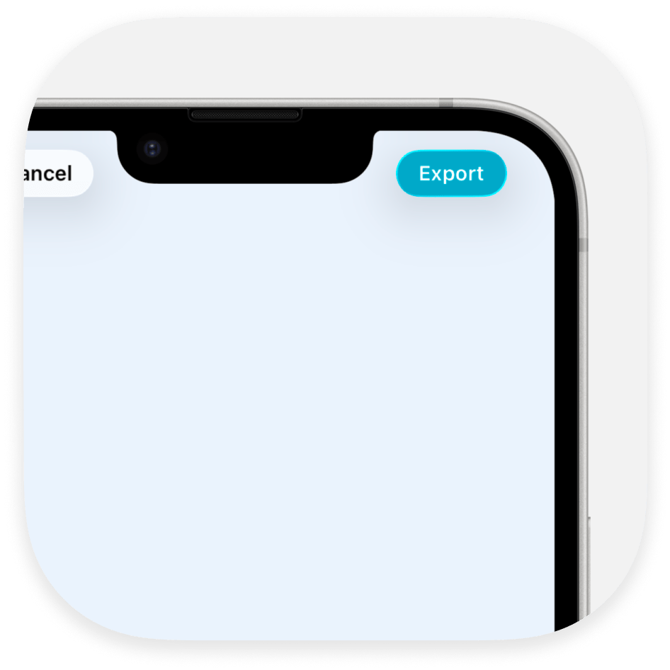
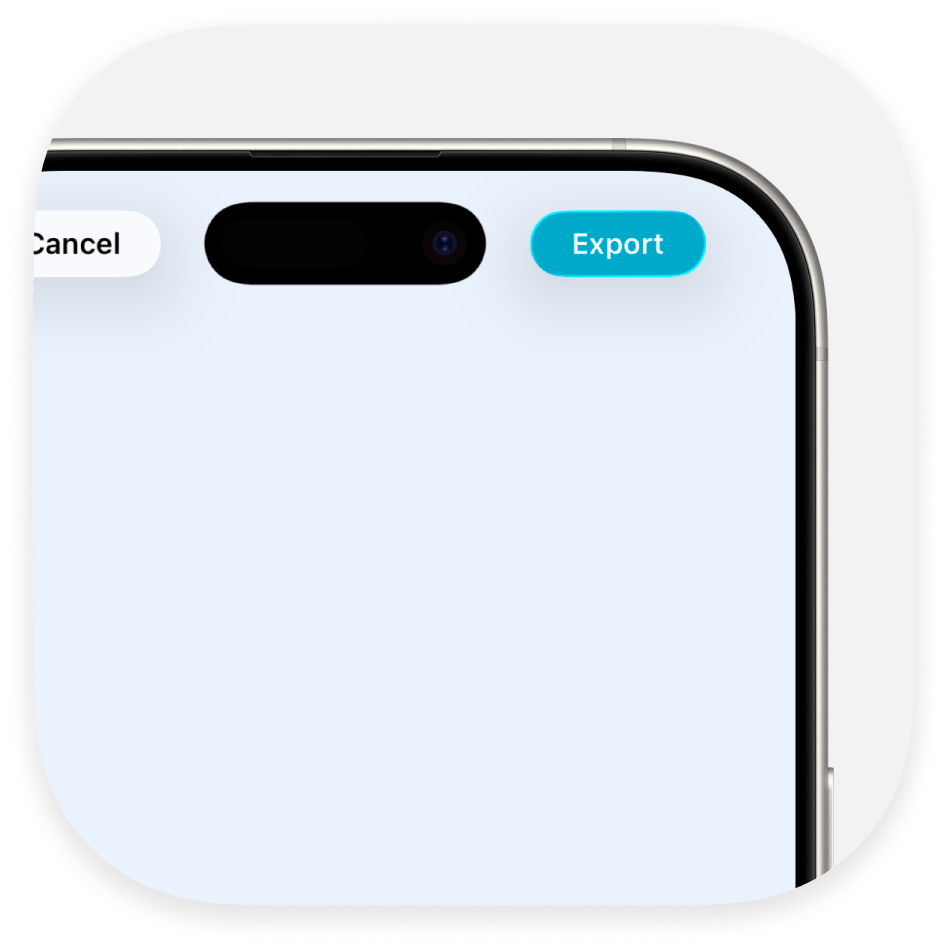
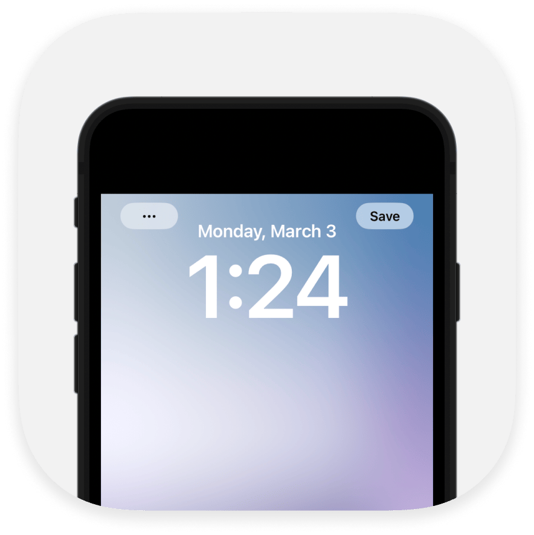
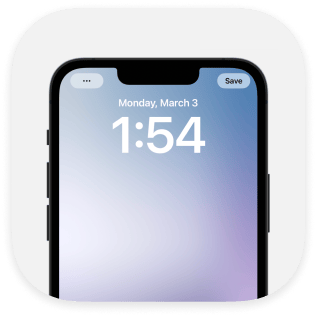

<div align="center">
  
  <h1><b>NotchMyProblem</b></h1>
  <p>Swift package that handles the annoying task of positioning UI elements around the iPhone's notch and Dynamic Island<br>
</div>

<div align="center">
  <a href="https://swift.org">
    
  </a>
  <a href="https://www.apple.com/ios/">
    
  </a>
  <a href="LICENSE">
    
  </a>
</div>

## **Overview**

NotchMyProblem is a lightweight Swift package that makes it easy to position buttons and other UI elements around the notch or Dynamic Island on modern iPhones. It automatically detects the device's top cutout and provides tools to create beautiful, adaptive layouts without the hassle of manual positioning.

## **Installation**

1. In Xcode go to **File > Add Packages…**  
2. Enter the repository URL: `https://github.com/Aeastr/NotchMyProblem`  
3. Click **Add Package**

Alternatively, add it to your `Package.swift` dependencies:

```swift
// Package.swift
dependencies: [
  .package(url: "https://github.com/Aeastr/NotchMyProblem.git", from: "2.0.0")
]
```

---

## **Key Components**

|  |  |  |
|:-----------------------------:|:-----------------------------:|:-----------------------------:|
| **Notch Devices**             | **Dynamic Island Devices**    | **Standard Devices**          |
| Automatically positions buttons around the notch | Adapts to the Dynamic Island's dimensions | Falls back to standard positioning |
| Works with iPhone X → iPhone 14 Series, iPhone 16e | Supports iPhone 14 Pro and newer | Compatible with older iPhones |
| Applies device-specific adjustments | Uses precise measurements | Maintains consistent UI across all devices |

NotchMyProblem automatically detects the device type and adjusts the UI accordingly, ensuring your buttons are perfectly positioned regardless of the device model.

---

## **Basic Usage**

### CutoutAccessoryView

The simplest way to use NotchMyProblem is with the included `CutoutAccessoryView`.

```swift
import SwiftUI
import NotchMyProblem

struct MyView: View {
    var body: some View {
        ZStack {
            // Your main content here

            // Buttons positioned around the notch/island
            CutoutAccessoryView(
                padding: .auto,
                leadingContent: {
                    Button(action: { print("Left tapped") }) {
                        Image(systemName: "gear")
                    }
                },
                trailingContent: {
                    Button(action: { print("Right tapped") }) {
                        Text("Save")
                    }
                }
            )
        }
    }
}
```

---

## **Why Padding?**

Modern iPhones have notches, Dynamic Islands, and heavily rounded corners. If you place buttons or other UI elements too close to these cutouts you risk:

- Elements appearing cramped or uncomfortably close to the cutout  
- Parts of your UI being clipped by the curved screen edges  
- Inconsistent spacing across different device models  

By adding padding that *scales* with the actual cutout dimensions, NotchMyProblem ensures that your content:

1. Always sits at a safe distance from the notch/island  
2. Never collides with the device’s rounded corners  
3. Maintains a consistent, polished look on every supported iPhone  

---

## **Padding Customization**

You can control three kinds of padding:

1. **Cutout padding** – extra space _around_ the notch/island itself  
2. **Content padding** – extra space on either side of your HStack content  
3. **Vertical padding** – extra space above and below your content  

Use the `padding` parameter when initializing `CutoutAccessoryView`:

```swift
CutoutAccessoryView(
  padding: .auto,  // default: cutoutW/8, contentW/4, verticalH*0.05
  leadingContent: { /* … */ },
  trailingContent:{ /* … */ }
)
```

### Available Modes

- **`.auto`**  
  Applies recommended defaults based on the actual cutout size

- **`.none`**  
  No extra padding; your views will hug the safe-area edges exactly.

- **`.custom(cutout: , content: , vertical:)`**  
  Supply closures to compute each padding dynamically:

  ```swift
  CutoutAccessoryView(
    padding: .custom(
      cutout:  { cutoutW  in cutoutW / 12 },    // 1/12 of cutout width
      content: { cutoutW  in cutoutW / 6  },    // 1/6 of cutout width
      vertical:{ cutoutH  in cutoutH * 0.2 }     // 20% of cutout height
    ),
    leadingContent: { /* … */ },
    trailingContent:{ /* … */ }
  )
  ```

---

## **Advanced Usage**

<div align="left">
  
  <h3><b>Custom Overrides for API Inaccuracies</b></h3>
  <p>Some devices report incorrect notch dimensions through the API. Overrides correct the reported values to match actual device dimensions, ensuring consistent UI across all devices.</p>
</div>

### 1. Global Overrides (App-wide)

```swift
// In your App’s initialization (e.g. in @main or AppDelegate)
NotchMyProblem.globalOverrides = [
    .series(prefix: "iPhone13", scale: 0.95, heightFactor: 1.0, radius: 27),
    DeviceOverride(modelIdentifier: "iPhone14,3", scale: 0.8, heightFactor: 0.7)
]
```

### 2. Instance Overrides

```swift
// At runtime, for specific cases
NotchMyProblem.shared.overrides = [
    DeviceOverride(modelIdentifier: "iPhone14,3", scale: 0.8, heightFactor: 0.7)
]
```

### 3. View-Specific Overrides (SwiftUI)

```swift
CutoutAccessoryView(/* … */)
  .notchOverride(.series(prefix: "iPhone14", scale: 0.6, heightFactor: 0.6))
```

#### Override Precedence

1. View-specific overrides  
2. Instance-specific exact model  
3. Instance-specific series prefix  
4. Global exact model  
5. Global series prefix  

---

## **Manual Access**

```swift
let rawRect    = NotchMyProblem.exclusionRect                   // raw API result
let adjusted   = NotchMyProblem.shared.adjustedExclusionRect    // with global/instance overrides
let customRect = NotchMyProblem.shared.adjustedExclusionRect(using: myOverrides)
```

---

## **How It Works**

1. Uses Objective-C runtime to safely fetch the exclusion area  
2. Falls back gracefully if the API is unavailable  
3. Applies device-specific scale/height overrides  
4. Provides SwiftUI modifiers and environment overrides for fine-grained control  
5. Includes logging (iOS 14+ `Logger`, iOS 13 `os_log`)  

---

## **Compatibility**

- iOS 13.0+  
- All notched iPhones (X → 14, 16e…)  
- Dynamic Island devices (14 Pro, newer)  
- Fallback for devices without cutouts  

---

## **Logging**

Filter Console with subsystem `com.notchmyproblem` to see debug/info/error logs.

---

## **License**

MIT — see [LICENSE.md](LICENSE.md)

## **Contributing**

Please review [CONTRIBUTING.md](CONTRIBUTING.md) before opening PRs.

## **Support**

If you like it, please give a ⭐️

---

# Acknowledgments

- Inspired by [TopNotch](https://github.com/samhenrigold/TopNotch)  
- Uses private APIs safely—use at your own risk

---

## Where to find me:  
- here, obviously.  
- [Twitter](https://x.com/AetherAurelia)  
- [Threads](https://www.threads.net/@aetheraurelia)  
- [Bluesky](https://bsky.app/profile/aethers.world)  
- [LinkedIn](https://www.linkedin.com/in/willjones24)

<p align="center">Built with 🍏📱🏝️ by Aether</p>
